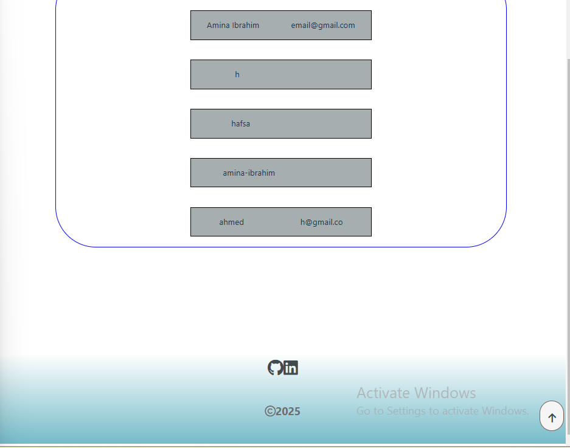

did the form validation workshop then later decided to apply some concepts learnt.

(i mostly had to refer back to previous codes alot )

=>using react router doms here done using form buttons to show diffrent forms

=> connected the server to supabase and the form the data from multipleinput form send data successfully to the db in supabase and the entire database input is then shown back on the page.

unfortunatiley the input sent isn't ok as this is how my data ends up being saved

overall i was able to apply the diffrent concepts in regards to saving the user form data to the db and rendering it back on the page

nearly forgot the sql images

i just thought of it maybe i should put the fetch inside the handle submit function this then eleminates the issue i have of how it data was being saved in the db. ill do that tomorrow 😴 
