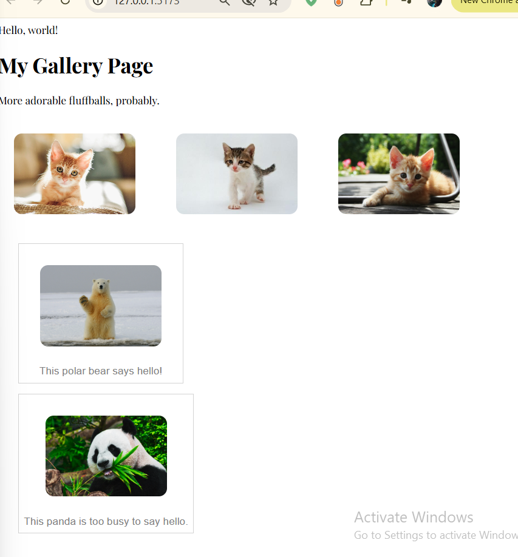

# **REACT: PROPS**

_WORSKHOP_
Props are the inputs to the component function - just like arguments to a function. You pass props like you use HTML attributes, and they are available inside the component function as an object.

